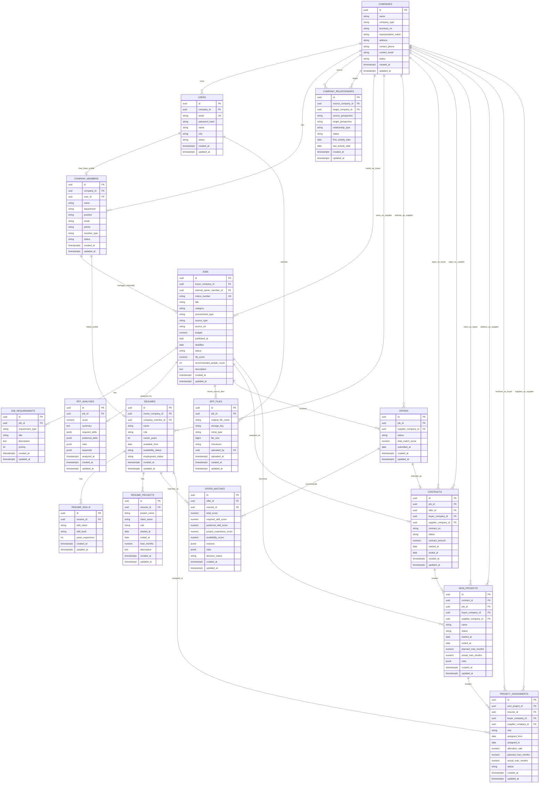

# BERYL ERD

## 1. 문서 목적

이 문서는 BERYL의 예상 데이터 모델과 주요 관계를 정리한다.

현재 저장소는 인덱싱 단계이므로 이 ERD는 확정 DB 스키마가 아니라, `docs/spec.md`, `docs/requirements.md`, Stitch 화면 흐름, 현재 client 타입을 기준으로 한 데이터 모델 초안이다. 실제 migration 작성 시에는 이 문서를 기준으로 하되, API 요구사항과 화면 단위 구현을 다시 확인한다.

## 2. 핵심 전제

BERYL의 로그인 주체는 발주기관 계정과 공급기업 계정으로 분리하지 않는다.

한 회원은 하나의 기업에 소속되고, 그 기업이 업무 문맥에 따라 발주 관점 또는 공급 관점을 가진다.

```text
A기업 로그인
→ A기업 기준 대시보드
→ A기업이 공급 관점에서 관계 맺은 발주처/기관 목록 확인
→ 특정 발주처 상세
→ 해당 발주처에 A기업이 공급한 직원/투입 인력 목록 확인
```

반대로 A기업이 다른 기업에 사업을 발주하는 문맥에서는 A기업이 발주 관점이 되고, 상대 기업이 공급 관점이 된다.

따라서 데이터 모델은 `agencies`와 `suppliers`를 별도 로그인 주체로 나누지 않고, `companies`를 중심으로 설계한다. 발주/공급은 `company_relationships`, `jobs`, `offers`, `contracts`, `won_projects`, `project_assignments` 안에서 정해지는 관점이다.

## 3. Naming And Common Fields

권장 규칙:

- 테이블명은 snake_case 복수형을 사용한다.
- 기본키는 `id`를 사용한다.
- ID 타입은 PostgreSQL UUID를 우선 검토한다.
- 상태값은 enum 또는 constrained text로 관리한다.
- 날짜/시간은 `timestamp with time zone`을 사용한다.

주요 영속 테이블 공통 필드:

- `id`
- `created_at`
- `updated_at`
- `created_by`
- `updated_by`
- `deleted_at`

`deleted_at`은 soft delete가 필요한 테이블에 우선 적용한다.

## 4. Core ERD



## 5. Table Groups

### 5.1 Identity And Companies

#### `companies`

로그인과 거래 관계의 기준이 되는 기업이다.

발주기관/공급기업을 별도 테이블로 나누지 않는다. 기업이 어떤 프로젝트에서 발주 관점인지 공급 관점인지는 관계 테이블과 업무 테이블의 FK로 판단한다.

#### `users`

로그인 사용자 계정이다.

주요 포인트:

- 일반 사용자는 `company_id`를 가진다.
- `role` 후보는 `systemAdmin`, `companyUser`다.
- `systemAdmin`은 전체 기업과 전체 데이터를 볼 수 있다.
- `systemAdmin`은 일반 회원가입으로 생성하지 않고, 프로그램 초기 설정, seed, 운영 스크립트 같은 별도 경로로 생성한다.
- `companyUser`는 본인 `company_id` 기준으로 접근 범위를 제한한다.
- 회원가입 API는 `role` 값을 받지 않으며, 신규 가입 사용자는 `companyUser`로 생성한다.

#### `company_members`

기업 소속 담당자/직원 정보다.

`users`는 로그인 계정이고, `company_members`는 기업 구성원 프로필이다. 모든 기업 구성원이 로그인 계정을 가져야 하는 것은 아니므로 `user_id`는 nullable로 둘 수 있다.

### 5.2 Company Relationships

#### `company_relationships`

두 기업 사이의 거래 관계를 표현한다.

예:

```text
A기업이 B기관에 인력을 공급
source_company_id = A기업
target_company_id = B기관
source_perspective = supplier
target_perspective = buyer
```

```text
A기업이 C기업에 사업을 발주
source_company_id = A기업
target_company_id = C기업
source_perspective = buyer
target_perspective = supplier
```

`relationship_type` 후보:

- `bid_participation`
- `contract`
- `won_project`
- `preferred_partner`

`status` 후보:

- `active`
- `inactive`
- `pending`

이 테이블은 기업 대시보드에서 “내 기업과 관계 있는 발주처/공급사 목록”을 빠르게 보여주는 데 사용한다. 기업 관계는 계약/공고/수주 이력에서만 파생하지 않고 `company_relationships`에 명시 저장한다.

### 5.3 Bid Notices And RFP

#### `jobs`

입찰 공고다. BERYL에서의 공고 등록은 회원이 공식 공고를 발행한다는 뜻이 아니라, 외부에 존재하는 입찰 공고를 내부 관리 대상으로 등록/추적한다는 뜻이다.

`buyer_company_id`는 해당 공고의 발주 관점 기업이다. `internal_owner_member_id`는 현재 기업 내부에서 해당 공고를 관리하는 단일 담당자다.

공고 출처 관련 필드:

- `procurement_type`: `public`, `private`
- `source_type`: `nara`, `private_bid`, `manual`, `email`, `other`
- `source_url`: 원본 공고 URL

`status` 후보:

- `draft`
- `open`
- `closingSoon`
- `closed`
- `awarded`

#### `job_requirements`

공고의 요구사항이다.

`requirement_type` 후보:

- `required`
- `preferred`
- `technical`
- `business`
- `schedule`
- `risk`

#### `rfp_analyses`

RFP 분석 결과다.

분석 결과는 의사결정 지원 정보이며 최종 입찰/인력 확정을 자동 수행하지 않는다. 기술 키워드, 위험 요소, 우대 조건처럼 구조가 유동적인 항목은 초기에는 `jsonb`로 둔다.

#### `rfp_files`

RFP/제안요청서/과업지시서 같은 원문 파일을 저장한다.

원문 파일은 분석 근거 확인, 재분석, 감사 추적을 위해 보관한다. 파일 본문은 DB에 직접 넣지 않고, 파일 저장소의 `storage_key`와 메타데이터를 DB에 저장한다.

저장 대상 예:

- 제안요청서 PDF/DOCX/HWP
- 과업지시서
- 입찰유의서
- 요구사항정의서

### 5.4 Resumes And Skills

#### `resumes`

기업이 보유하거나 공급 가능한 인력 상세 프로필이다. 인력 현황 화면의 개인별 상세 정보가 이 테이블에 해당한다.

`company_members`와 `resumes`는 완전히 분리한다. 다만 같은 사람이 기업 구성원이면서 투입 가능한 인력일 수 있으므로, 선택 연결 필드인 `company_member_id`를 둔다.

`owner_company_id`는 해당 인력을 공급할 수 있는 기업이다.

`availability_status` 후보:

- `available`
- `assigned`
- `partiallyAssigned`
- `unavailable`

#### `resume_skills`

인력별 기술 스택이다.

#### `resume_projects`

인력별 과거 프로젝트 이력이다.

### 5.5 Offers And Matching

#### `offers`

공급 관점 기업의 입찰 참여/제안 단위다.

`supplier_company_id`가 제안 기업이다.

`status` 후보:

- `draft`
- `submitted`
- `awarded`
- `rejected`

#### `offer_matches`

특정 offer에서 추천된 인력별 매칭 결과다.

주요 점수:

- 필수 기술 일치도
- 우대 기술 일치도
- 유사 프로젝트 경험
- 투입 가능성
- 위험 요소

`decision_status` 후보:

- `recommended`
- `shortlisted`
- `confirmed`
- `rejected`

사용자가 인력을 최종 확정하면 `decision_status`를 변경하고, 낙찰/계약 이후에는 `project_assignments`로 이어진다.

### 5.6 Contracts And Won Projects

#### `contracts`

낙찰 이후 발주 관점 기업과 공급 관점 기업 사이의 계약이다.

계약은 MVP부터 `contracts` 테이블로 명시 분리한다. `won_projects`에 계약 정보를 포함하지 않는다.

#### `won_projects`

낙찰 이후 실제 수행 사업이다.

`buyer_company_id`는 사업을 발주한 기업이고, `supplier_company_id`는 사업을 수행/공급하는 기업이다.

`status` 후보:

- `preparing`
- `inProgress`
- `atRisk`
- `completed`
- `cancelled`

#### `project_assignments`

수주 사업에 실제로 투입된 인력 목록이다.

이 테이블은 “A기업이 특정 발주처에 공급한 직원 리스트”를 조회하는 핵심 테이블이다.

M/M는 별도 월별 집계 테이블을 두지 않고 `project_assignments`의 기간, 투입률, 계획/실적 총합으로 관리한다. 필요하면 `allocation_rate`, `assigned_from`, `assigned_to`로 계산하고, 화면 표시나 수주 사업 요약을 위해 `planned_man_months`, `actual_man_months` 총합을 저장한다.

예:

```sql
select
  r.name,
  r.role,
  pa.assigned_from,
  pa.assigned_to,
  pa.allocation_rate,
  pa.planned_man_months,
  pa.actual_man_months,
  pa.status
from project_assignments pa
join resumes r on r.id = pa.resume_id
where pa.supplier_company_id = :current_company_id
  and pa.buyer_company_id = :selected_company_id;
```

## 6. 주요 조회 시나리오

### 6.1 A기업이 공급 관점에서 관계 있는 발주처 목록

목적:

- A기업 사용자가 로그인 후 A기업이 인력/사업을 공급한 발주처를 본다.

관계:

```text
companies
→ company_relationships
→ companies
```

조회 조건:

- `company_relationships.source_company_id = current_user.company_id`
- `company_relationships.source_perspective = 'supplier'`
- `company_relationships.target_perspective = 'buyer'`
- `company_relationships.status = 'active'`

### 6.2 발주처 상세에서 A기업이 공급한 직원 목록

목적:

- A기업 사용자가 특정 발주처 상세에서 A기업이 공급한 인력 목록을 본다.

관계:

```text
companies
→ project_assignments
→ resumes
```

조회 조건:

- `project_assignments.supplier_company_id = current_user.company_id`
- `project_assignments.buyer_company_id = selected_company_id`

### 6.3 A기업이 발주 관점에서 관계 있는 공급기업 목록

목적:

- A기업 사용자가 A기업이 사업을 발주한 공급기업 목록을 본다.

관계:

```text
companies
→ company_relationships
→ companies
```

조회 조건:

- `company_relationships.source_company_id = current_user.company_id`
- `company_relationships.source_perspective = 'buyer'`
- `company_relationships.target_perspective = 'supplier'`
- `company_relationships.status = 'active'`

### 6.4 입찰 공고별 추천 인력 매칭

목적:

- 입찰 공고 상세에서 추천 인력과 매칭 근거를 본다.

관계:

```text
jobs
→ offers
→ offer_matches
→ resumes
```

### 6.5 수주 사업별 M/M 현황

목적:

- 수주 사업에서 계획 M/M와 실제 M/M를 비교한다.

관계:

```text
won_projects
→ project_assignments
→ resumes
```

## 7. 초기 구현 우선순위

인덱싱 단계 이후 DB 구현을 시작한다면 다음 순서를 권장한다.

1. `companies`, `users`, `company_members`
2. `company_relationships`
3. `jobs`, `job_requirements`, `rfp_files`, `rfp_analyses`
4. `resumes`, `resume_skills`, `resume_projects`
5. `offers`, `offer_matches`
6. `contracts`, `won_projects`, `project_assignments`

이 순서는 현재 화면과 read API를 우선 연결하기 위한 제안이다. 실제 구현 시 seed data와 API endpoint 단위를 기준으로 조정한다.

## 8. Data Modeling Decisions

확정된 데이터 모델링 결정:

- `company_members`와 `resumes`는 완전히 분리한다.
- 같은 사람이 기업 구성원이면서 투입 가능한 인력일 수 있으므로 `resumes.company_member_id` 선택 연결 필드를 둔다.
- 계약은 MVP부터 `contracts` 테이블로 명시 분리한다.
- `won_projects`에는 계약 상세 정보를 중복 저장하지 않고 `contract_id`로 연결한다.
- RFP 원문 파일은 저장한다.
- RFP 파일 본문은 DB에 넣지 않고 파일 저장소에 보관하며, DB에는 `rfp_files` 메타데이터를 저장한다.
- 입찰 공고 담당자는 단일 내부 담당자로 본다.
- `jobs.internal_owner_member_id`로 `company_members`와 직접 연결한다.
- 기업 관계는 `company_relationships`에 명시 저장한다.
- 기업 관계는 계약/공고/수주 이력에서만 파생하지 않는다.
- M/M는 월별 집계 테이블을 별도로 두지 않는다.
- M/M는 `project_assignments`의 기간, 투입률, 계획/실적 총합을 기준으로 계산한다.

추후 월별 정산, 월마감, 월별 확정 보고가 필요해지면 `assignment_monthly_man_months` 같은 월별 집계 테이블을 추가한다.
